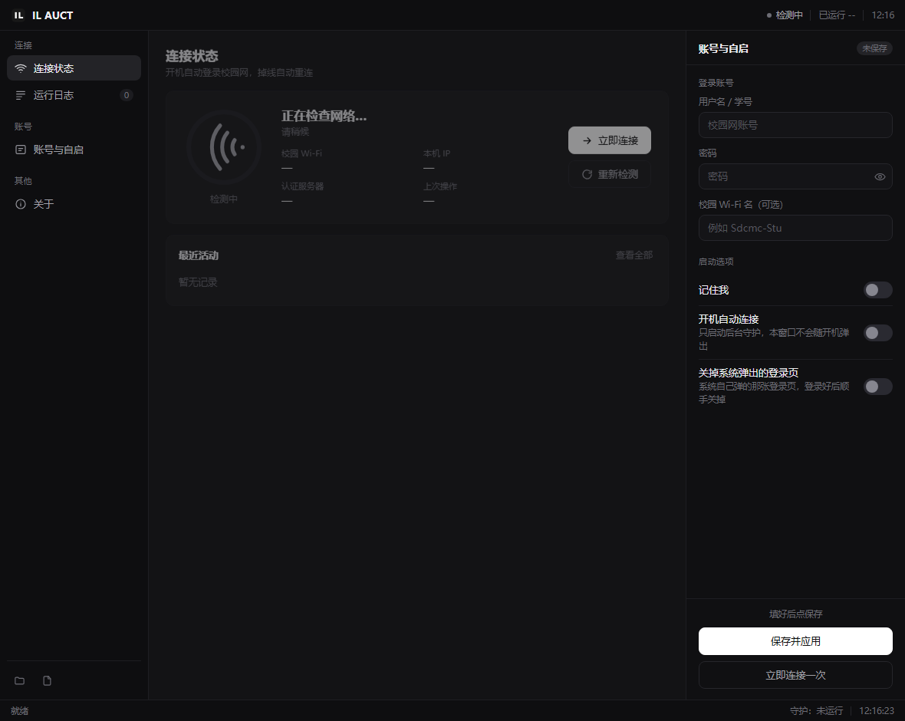

# IL AUCT

> 校园网自动登录助手 —— 开机无感联网，再也不用点那个认证页面。

一个跑在 Windows 上的小工具，帮你自动连上校园 Wi-Fi 并完成 Portal 认证。
设置一次，之后开机就自动联网；平时它只在后台静静待着，不会弹窗打扰你。



---

## 特性

- **开机自动联网** —— 登录后由后台守护进程静默完成「连 Wi-Fi → 认证」，不需要你动手
- **无感运行** —— 守护进程不带界面，不弹窗；只有你想改设置时才需要打开本软件
- **自动重连** —— 掉线后自动重新认证，切换回校园网也会立刻恢复
- **关掉烦人的登录页** —— 自动关闭系统在无网时弹出的浏览器认证页
- **开机加速（可选）** —— 绕开 Windows 启动项排队，提前十几秒通网
- **自动更新** —— 启动时静默检查新版本，有更新一键升级
- **图形界面** —— 本地网页界面，无需命令行
- **自带卸载器** —— 一键清理程序、自启项和计划任务

## 快速开始

1. 到 [Releases](https://github.com/bass1125/IL-AUCT/releases) 下载最新的 `IL AUCT.exe`
2. 放到一个**固定不动**的目录（比如 `D:\i_Lian\CampusNetAssistant\`）
3. 双击运行，填入你的校园网账号密码
4. 勾上「开机自动连接」，保存

以后开机就自动联网了。想改设置再打开软件即可。

> **重要**：程序路径不能随便挪。移动后需要在界面里重新勾一次「开机自动连接」，
> 好让它把注册表里的启动路径刷新过来。

### 关于「开机加速」

Windows 会把注册表启动项排在「桌面已经出来」之后才处理，实测中间会空 20 秒左右。
勾上界面里的「开机加速」，软件会注册一个「登录时」触发的计划任务，登录瞬间就把守护拉起来。

- 建计划任务需要管理员权限，所以**只在你勾选状态真的变了**的时候才会弹一次 UAC
- 原来的启动项会保留作兜底，两个一起启动也不会冲突（有单实例锁）
- 想取消就取消勾选再保存，同样会弹一次 UAC
- 卸载器会顺手清掉这个计划任务

## 自动更新怎么工作

- 软件启动时在后台静默查询一次 GitHub Release（走 `api.github.com`）
- 发现新版本会在界面上提示，**只有你点「立即更新」才会下载**
- 下载走国内加速通道 `gh-proxy.com`，不用直连 GitHub
- 新版本下载到临时目录后，生成一个替换脚本，重启软件即可生效
  （exe 正在运行时无法自我覆盖，这是 Windows 的限制）

## 从源码运行

需要 Python 3.8+，无第三方依赖。

```bash
git clone https://github.com/bass1125/IL-AUCT.git
cd IL-AUCT/CampusNetAssistant
python app.py
```

开发模式下 `app.py` 会自动从同级目录 `../campusnet-autologin/campusnet` 加载底层库。

### 打包

```bash
cd CampusNetAssistant
pyinstaller "IL AUCT.spec"
```

## 目录结构

```
.
├── CampusNetAssistant/            # IL AUCT 图形外壳
│   ├── app.py                     # 主程序：本地 HTTP 服务 + 界面宿主 + 守护管理
│   ├── uninstall.py               # 卸载器
│   ├── web/                       # 前端界面（原生 HTML/CSS/JS）
│   ├── install_autologin.ps1      # 开机加速：注册登录计划任务
│   ├── remove_autologin.ps1       # 开机加速：移除计划任务
│   ├── 开机加速.bat               # 以上脚本的自提权入口
│   └── IL AUCT.spec               # PyInstaller 打包配置
└── campusnet-autologin/
    └── campusnet/                 # 底层自动登录库（源自上游 MIT 项目）
        ├── runner.py              # 守护主循环：热身、重试、状态机
        ├── wifi.py                # Wi-Fi 连接与网卡就绪等待
        ├── detector.py            # 联网状态探测、门户地址发现
        ├── providers/             # 各认证方式实现（华为 Portal 等）
        ├── autostart.py           # 开机自启注册
        ├── singleton.py           # 单实例锁
        ├── popup.py               # 关闭系统弹出的认证页
        └── tests/                 # 单元测试
```

## 工作原理（简述）

1. 开机后守护进程启动，进入**热身阶段**：180 秒内每 5 秒试一次，直到联网
2. 每一轮：确认 Wi-Fi 已连上 → 探测是否已认证 → 未认证则找到门户地址 → 提交认证
3. 认证前会等 DHCP 真正拿到 IP（拿空 IP 去认证会被服务端判「认证超时」）
4. 认证成功后校验确实联网，然后转为低频巡检，掉线自动重连
5. 检测到「离线 → 在线」转变时，扫一遍并关掉系统弹出的认证页

## 已知限制

- 仅支持 Windows（依赖 `netsh` 和 WMI）
- 认证方式目前主要适配**华为 Portal**；其它厂商的门户可能需要在 `providers/` 下新增实现
- 账号密码以明文存储在 `%APPDATA%\campusnet\config.json`（已排除在仓库外）
- 学校若禁用了计划任务策略，「开机加速」会失败，不影响其它功能

## 致谢

底层自动登录能力来自开源项目 [demo133/campusnet](https://github.com/demo133/campusnet)（MIT License），
本项目在其基础上做了大量定制与图形界面的封装。

## License

[MIT](LICENSE)
